# Building Analytics for a CMS EDR/CRR Risk-Adjustment Submission Module

## Executive summary

A high-value Encounter Data Repository and Chart Review Record analytics layer should not be designed as a conventional “claims dashboard.” It should function as a **closed-loop control system** connecting source encounters and medical-record-derived diagnoses to the X12 837 submission, CMS front-end acknowledgements, EDPS disposition, final risk-adjustment eligibility, and ultimately the Part C CMS-HCC and Part D RxHCC models. Federal rules require Medicare Advantage organizations to submit data sufficient to characterize the context and purpose of covered items and services, conform to CMS and national standards, obtain the data from the furnishing provider or practitioner, and include a billing-provider NPI on encounter data. CMS can also require medical records to validate risk-adjustment data. citeturn12view0

The supplied CMS *Encounter Data Submission and Processing Guide*, identified in the document as Version 5.2, May 2025, provides the operational backbone for this design: EDR/CRR creation in X12 837 5010; linked and unlinked CRR rules; EDFES processing through pre-screening, TA1, 999, 277CA, and post-screening; EDPS MAO-001/MAO-002 reporting; Internal Control Number assignment; replacement/void behavior; duplicate edits; and the role of MAO-004 as the downstream risk-adjustment eligibility report. fileciteturn0file0

For **CY 2026**, non-PACE Part C risk scores are calculated 100% under the 2024 CMS-HCC model after completion of its three-year phase-in. CMS also maintains official payment-year-specific model software and ICD-10 mappings; therefore, every HCC/RxHCC analytic should be explicitly versioned by payment year rather than hard-coded to a single crosswalk. citeturn13search0turn9search3

A particularly important design requirement as of September 2026 is **CY 2027 readiness**. CMS finalized a policy excluding diagnoses reported on non-exempt **unlinked CRRs** from risk-score calculation beginning in 2027, with an exception for beneficiaries who switch from one MA organization to another. CMS also aligned Part D diagnosis-source policy with this approach. That makes “unlinked-CRR risk-score dependency” one of the most urgent analytics to deploy now. citeturn9search4

Part D requires careful architectural separation. Health status affects Part D payment, and CMS requires MA-PD plans and PDPs to submit drug-claim data linkable to other Medicare data. Therefore, an EDR/CRR repository can legitimately calculate **RxHCC diagnosis impact and Part D health-status risk**, but EDR/CRR processing should not be misrepresented as the Part D Prescription Drug Event submission process itself. citeturn12view1

The recommended **Top 10 high-impact analytics**, in implementation order, are:

| Priority | High-impact analytic | Primary business value | Value | Effort |
|---|---|---|---|---|
| 1 | End-to-end submission acceptance funnel | Prevent encounter loss before CMS acceptance | Very high | Medium |
| 2 | RA-eligible diagnosis yield and leakage | Find diagnoses lost between source, EDS and MAO-004 | Very high | High |
| 3 | CMS-HCC/RxHCC risk-score reconciliation and value-at-risk | Translate data defects into payment exposure | Very high | High |
| 4 | CY 2027 unlinked-CRR dependency | Mitigate imminent policy-driven RAF loss | Very high | Medium |
| 5 | Submission timeliness, backlog and deadline exposure | Reduce end-window congestion and missed data | High | Low |
| 6 | MAO-002 rejection/edit Pareto and remediation | Concentrate fixes on largest rejection causes | High | Low |
| 7 | Duplicate and adjustment-chain integrity | Prevent MAO-001 and sequencing rejections | High | Medium |
| 8 | Unsupported/high-risk diagnosis audit exposure | Reduce RADV/OIG/compliance risk | Very high | High |
| 9 | Supported chronic-condition recapture surveillance | Identify legitimate documentation/care gaps | High | Medium |
| 10 | Source-to-EDS completeness and utilization parity | Detect missing encounter populations | High | Medium |

The next tier should cover default-data usage, beneficiary identity, provider eligibility, capitated encounters, CRR lifecycle controls, service/filter eligibility, prevalence anomalies, file conformance, CMS acknowledgement aging, and special-service compliance.

The central management principle is:

> **Do not optimize for “diagnoses submitted.” Optimize for complete, timely, valid encounters whose diagnoses are medically supported, survive CMS processing, receive the intended MAO-004 eligibility outcome, and reconcile to the appropriate CMS-HCC/RxHCC model.**

That distinction is important from both a financial and compliance perspective. OIG continues to identify material risk around diagnosis submissions without adequate medical-record support. In a 2024 national analysis, diagnoses reported only on HRAs or HRA-linked chart reviews, without another 2022 service record, were associated with an estimated $7.5 billion in 2023 risk-adjusted payments. More recently, OIG reported that 178 of 220 sampled enrollee-years in a 2026 HumanaChoice audit lacked support for selected diagnosis codes. citeturn9search15turn10search0


## Regulatory and architectural basis

**Scope interpretation.** The proposed repository should cover three logically different subjects:

1. **Encounter submission integrity:** Did every reportable encounter reach CMS in a valid form?
2. **Diagnosis/risk-adjustment integrity:** Which submitted diagnoses ultimately qualify for CMS-HCC or RxHCC use?
3. **Payment/reconciliation impact:** What is the difference between locally expected risk and CMS-returned risk, and what operational or financial exposure does that represent?

The Part C regulation requires data characterizing each item and service, including relevant supplemental benefits to the extent CMS requires them, and requires electronic submission under CMS/national standards. Risk-adjustment submission deadlines are also governed by 42 CFR 422.310; the regulation provides September and March annual submission points plus a later final reconciliation deadline, after which diagnoses may be submitted to correct overpayments but not to obtain additional payment. citeturn12view0

For Part D, CMS adjusts standardized bids for health status and publishes the applicable risk-adjustment methodology through the annual Advance Notice and Rate Announcement. MA-PD drug-claim data must be linkable at the beneficiary level to other required CMS data. citeturn12view1

**Important model-version assumption.** Analytics must carry at least `service_year`, `payment_year`, `model_version`, `icd_mapping_version`, `filter_version`, and `coefficient_version`. For 2026, CMS uses the 2024 CMS-HCC model at 100% for non-PACE organizations; CMS publishes separate 2026 and 2027 model software/ICD mappings. citeturn13search0turn9search0turn9search3

### Assumptions and design decisions

| Subject | Assumption / recommendation |
|---|---|
| Data freshness | **Unspecified**, per the request. Do not hard-code a freshness SLA. Persist `source_loaded_at`, `normalized_at`, `submitted_at`, `ack_received_at`, `mao002_received_at`, and `mao004_received_at` so freshness can be measured under any eventual SLA. |
| Technology stack | **Unspecified.** SQL below is ANSI-style pseudocode and is implementable in Snowflake, Databricks, BigQuery, Redshift, SQL Server, Oracle, or equivalent platforms. |
| Reporting cadence | **Unspecified.** The semantic model should support intraday, daily, weekly and monthly reporting without changing metric definitions. |
| Source data volume/sample size | **Unspecified.** For provider or diagnosis-rate comparisons, recommended analytic suppression is `<30` observations and a stability warning for small denominators. This is an analytical recommendation, not a CMS rule. |
| Data model | Assumed logical star/event model with immutable raw transactions and normalized facts. |
| Retention horizon | Recommended 24–36 months of readily queryable operational history plus longer compliance/audit retention under the organization's records policy. This is a design recommendation, not a CMS retention rule. |
| Financial estimates | “Revenue at risk” should be presented as an **estimate/scenario**, not booked revenue, unless the complete applicable benchmark/bid/payment methodology is modeled. |
| Medical-record support | A diagnosis that maps to an HCC/RxHCC is not automatically considered valid for submission. Medical-record and CMS eligibility requirements remain independent gates. |

### Recommended logical data model

The minimum analytic model should contain:

| Fact/dimension | Grain | Important fields |
|---|---|---|
| `fact_encounter` | One internal/source encounter | encounter ID, member, provider, contract/PBP, DOS, claim type, TOB, paid/adjudicated status, capitated indicator |
| `fact_service_line` | One encounter/service line | CPT/HCPCS, modifier, revenue code, units, POS, HIPPS, billed/paid amounts |
| `fact_diagnosis` | One encounter-diagnosis | ICD-10-CM, diagnosis position, source type, chart-review flag, support status, HCC/RxHCC mappings |
| `fact_submission_record` | One EDR/CRR submission instance | file, ISA/GS/ST IDs, CLM01, record type, frequency code, linked ICN, creation/submission dates |
| `fact_submission_event` | One record × processing event | pre-screen, TA1, 999, 277CA, post-screen, MAO-001, MAO-002, MAO-004 |
| `fact_cms_edit` | One CMS edit occurrence | edit code, segment, loop, element, disposition, encounter/line, CMS report |
| `fact_ra_eligibility` | One diagnosis × CMS eligibility result | MAO-002 preliminary status, MAO-004 final eligibility, reason, service/payment year |
| `fact_risk_score` | Member × payment year × model | local Part C RAF, local RxHCC factor, CMS-returned score, scenario score |
| `dim_member` | Beneficiary | beneficiary identifier, enrollment periods, demographic factors |
| `dim_provider` | Provider | NPI, specialty, entity, network, group, geography |
| `dim_plan` | Contract/PBP | contract, PBP, product, MA/MA-PD indicator |
| `dim_diagnosis_hcc` | ICD × model version | HCC/RxHCC, hierarchy, coefficient/meta |
| `dim_cms_edit` | CMS edit code | stage, severity, explanation, remediation owner |

CMS' current Risk Adjustment resources publish model software, model diagnosis mappings, eligible/excluded CPT/HCPCS information, acceptable physician specialty resources, and related risk-adjustment materials, making those artifacts preferable to manually maintained third-party crosswalks. citeturn9search1turn9search0turn9search3

### Core CMS element mapping

The uploaded CMS guide states that EDRs and CRRs use the X12 837 5010 structure, with institutional 837-I and professional 837-P transactions and DME submitted through the professional format. It identifies control structures and key loops such as ISA/IEA, GS/GE, ST/SE, BHT, submitter/receiver, provider, subscriber, claim, service-line, and adjudication loops. fileciteturn0file0

| Business concept | CMS/X12 elements to preserve analytically | Main analytics enabled |
|---|---|---|
| File/submission identity | ISA06, ISA08, ISA13; GS02/03/06/08; ST02/ST03; matching trailers | Acceptance funnel, file errors, capacity |
| Submitter/receiver | 1000A/1000B NM1 identifiers | Routing, authorization, submitter performance |
| Contract | 2010BB REF02 / plan contract information | All contract-level reporting |
| Beneficiary | 2010BA subscriber identifier plus name/demographics | Member rejects, HCC/RxHCC, enrollment reconciliation |
| Billing provider | 2010AA NM109/NPI, EIN/reference fields | Provider quality, NPI validity, outliers |
| Encounter control | CLM01 | Record reconciliation, lineage |
| Frequency/action | CLM05-3, including original/replacement/void | Adjustment lifecycle |
| CRR identification | Loop 2300 PWK01=`09`, PWK02=`AA` | CRR analytics |
| Linked record | REF01=`F8`, REF02=accepted ICN | Linked/unlinked CRR, replacements/voids |
| CRR delete | Medical record reference `EA/8` plus diagnosis(es) | Delete integrity |
| Diagnosis | HI diagnosis elements/diagnosis order | HCC/RxHCC, MAO-004 eligibility |
| Dates | Claim/service DTP elements | Timeliness, eligibility, deadline analytics |
| Service | CPT/HCPCS, revenue, TOB, modifiers, POS, units | Filter/service eligibility |
| Capitation | CN101 and line-level rules; institutional CAS rules | Capitation compliance |
| Payment | Other-payer-paid AMT/SVD and submitted amounts | Financial/data completeness |
| Special services | HIPPS; ambulance 2310E/2310F; DME provider/referral fields | Special-service compliance |
| CMS ICN | 277CA accepted record REF01=`1K`, REF02=ICN | Adjustment lineage and reconciliation |
| EDPS disposition | MAO-002 header/line status + edit | Final encounter status |
| RA determination | MAO-002 preliminary RA fields and MAO-004 status | RA yield, risk reconciliation |

The guide explicitly notes that MAO-002's risk-adjustment assessment is preliminary and that **MAO-004 is authoritative when the two differ** for the assigned risk-adjustment status. That should be reflected in the semantic layer: never let the preliminary flag overwrite final MAO-004 status. fileciteturn0file0


## High-impact analytics

The ten metrics below should form the initial production release. “Recommended threshold” means an internal management control unless explicitly identified as a CMS threshold.

| Priority and analytic | Business rationale and expected action | KPI / calculation logic and pseudocode | Dimensions and visualization | Data lineage, required inputs and CMS mapping | Benchmark / threshold |
|---|---|---|---|---|---|
| **1. End-to-end submission acceptance funnel** | A high source-record count is meaningless if records are lost at file, transaction, record or EDPS stages. **Action:** assign failures to interface, EDI, data-quality or encounter teams at the exact failing stage. | `stage_yield = passed_stage / entered_stage`; `final_acceptance = MAO002_accepted / reportable_source_encounters`. Pseudocode: `COUNT(DISTINCT CASE WHEN stage='MAO002' AND status='A' THEN encounter_id END) / COUNT(DISTINCT reportable_encounter_id)` | Contract/PBP, submitter, 837-I/P/DME, provider, service month, source system, stage, edit. **Viz:** funnel + weekly run chart. | Claims/EHR → normalized encounter → 837 → pre-screen/TA1/999 → 277CA → EDPS/MAO-002. Requires file/control IDs, CLM01, contract, member, ICN, all status timestamps. CMS uses successive front-end and back-end processing stages. fileciteturn0file0 | **Recommended:** ≥99% final acceptance after normal correction cycle; required-field completeness 100%. Stage-specific baseline should be separately monitored. |
| **2. RA-eligible diagnosis yield and leakage** | Measures the actual conversion of candidate diagnoses into CMS-recognized RA diagnoses rather than merely counting submissions. **Action:** analyze disallowed diagnoses by service, procedure, provider specialty, CRR source and CMS reason; correct only where documentation/submission is legitimately deficient. | `RA_yield = MAO004_allowed_dx / locally_eligible_candidate_dx`. Build stages: source dx → valid ICD → model-mapped → qualifying encounter/filter → accepted encounter → MAO-004 allowed. SQL: `SUM(mao004_allowed)/SUM(local_candidate)` grouped by model/year. | Member, diagnosis, HCC/RxHCC, provider, specialty, claim type, CPT/HCPCS, CRR/EDR, contract, service month. **Viz:** waterfall / Sankey-style leakage funnel. | Diagnosis fact + official CMS ICD/model mappings + encounter eligibility/filter data + MAO-002 + MAO-004. CMS publishes payment-year model mappings/software and supporting eligibility resources. citeturn9search1turn9search3 | No universal CMS yield percentage. **Recommended:** compare with own rolling baseline; alert on >5 percentage-point adverse shift after adjusting for service mix. |
| **3. CMS-HCC/RxHCC risk-score reconciliation and value-at-risk** | Converts technical submission defects to a risk and financial view executives can act on. **Action:** investigate member/HCC differences; distinguish valid CMS filtering from missing records, late submissions or mapping errors. | Run official-version logic twice: `local_score = model(all_valid_accepted_dx)` and `CMS_reconciled_score = model(MAO004_allowed_dx)` or compare with authoritative CMS output where available. `RAF_gap = local - CMS`. Scenario financial exposure: `Δpayment ≈ marginal_ΔRAF × applicable_plan_payment_factor × member_month_fraction`; Part D uses appropriate RxHCC/direct-subsidy methodology rather than the Part C formula. | Contract/PBP, member, HCC/RxHCC, model segment, diagnosis, provider, payment month/year. **Viz:** variance waterfall and member-level reconciliation grid. | MAO-004 diagnosis eligibility → official CMS model software/mappings → MOR/MMR or other CMS risk/payment outputs when available. CMS uses health status in both Part C and Part D payment, but the methodologies differ. citeturn12view1turn13search0turn9search3 | Reconciled score difference should approach **0** once timing/model versions align. Financial result must be labelled estimate until actual payment inputs reconcile. |
| **4. CY 2027 unlinked-CRR dependency / RAF exposure** | A new policy risk with immediate business value. CMS finalized exclusion of non-exempt unlinked-CRR diagnoses from 2027 risk scores. **Action:** identify diagnoses/HCCs dependent solely on unlinked CRRs; locate the associated EDR/service where valid, improve encounter capture, or recognize the risk-score loss. Never fabricate linkage. | **Do not sum HCC coefficients naïvely because hierarchies/interactions are non-additive.** Scenario: `exposure_RAF = RAF(full eligible set) - RAF(remove non-exempt unlinked-CRR diagnoses)`. `exposure_pct = exposure_RAF / RAF(full)`. | Contract/PBP, member, HCC/RxHCC, diagnosis, CRR source/vendor, provider, collection year. **Viz:** stacked exposure bars + HCC heatmap. | PWK CRR flag + absence/presence of F8-linked accepted ICN + member-switch exception indicator + diagnosis → HCC/RxHCC model. CMS finalized the 2027 exclusion with a member-switch exception and aligned Part D sources similarly. citeturn9search4 | **Policy target:** 0 projected 2027 score dependency on non-exempt unlinked CRRs. Internal warning can begin at any non-zero material exposure. |
| **5. Submission timeliness, backlog and deadline exposure** | Late batches create operational congestion, shorten correction windows and increase risk that valid diagnoses do not reach final processing in time. **Action:** accelerate provider feeds, claims extraction, QA, submission and error remediation by aging bucket. | `source_lag = submitted_at - source_ready_at`; `cms_accept_lag = mao002_accept_at - source_ready_at`; backlog = reportable not yet accepted. Also `late_window_pct = applicable-year EDR/CRR submitted in final 2 months / total applicable-year EDR/CRR`. | Contract, service month, submission month, source/vendor, provider, encounter type, age bucket. **Viz:** aging histogram + cumulative submission curve against deadline. | Source adjudication/event timestamps + 837 transmission + CMS acknowledgement timestamps. The CMS guide specifies minimum submission frequencies by contract enrollment and includes a historical compliance threshold of **27% or more** in the last two months before the RA deadline as excessive late submission. fileciteturn0file0 | **CMS historical monitoring reference:** red at ≥27% in final two months. **Recommended early warning:** 20%. Also monitor compliance with applicable contract-level submission-frequency rules. |
| **6. MAO-002 rejection and CMS edit Pareto** | The fastest way to improve throughput is generally to fix the few edits responsible for most rejections. **Action:** route top edits to ownership teams, remediate root causes and verify post-fix decline. | `reject_rate = rejected_records / processed_records`; `edit_share = edit_count / all_reject_edits`; `repeat_rate = rejected_again_after_resubmission / resubmitted`. Rank edits and compute cumulative Pareto share. | Edit code, header/line, loop/segment, contract, submitter, source, provider, record type, DOS, remediation owner. **Viz:** Pareto bar + trend. | MAO-002 record/line status and edits, supplemented by TA1/999/277CA errors. Header rejection rejects the record; accepted header plus at least one accepted line yields an accepted record. fileciteturn0file0 | No universal CMS “good reject rate.” **Recommended:** green <1%, amber 1–3%, red >3% after stabilization; separately trend first-pass acceptance. |
| **7. Duplicate and adjustment-chain integrity** | Blind resubmissions create duplicate errors and replacement/void sequencing failures. **Action:** stop concurrent children of the same parent ICN, wait for disposition where required, and distinguish legitimate distinct services from true duplicates. | `duplicate_rate = encounters with MAO001 duplicate edit / submitted encounters`. Create graph `original_ICN → replacement/void_ICN`. Flag >1 pending active child per parent. Track EDPS 98300/98315/98320/98325 plus 00265/00755/00760. | Parent ICN, child ICN, claim frequency, provider, member, service line, diagnosis, file, error. **Viz:** duplicate Pareto + adjustment-chain graph. | 277CA ICN + CLM05-3 + F8 reference + MAO-001 + MAO-002. CMS warns that premature adjustments can produce 00265 and repeated child actions may generate 00755/00760; MAO-001 reports duplicate classes. fileciteturn0file0 | **Recommended:** duplicate-reject rate <0.25%; investigate >1%. Zero illegal lifecycle states. |
| **8. Unsupported/high-risk diagnosis audit exposure** | Financial upside from a diagnosis is not business value when documentation is inadequate. OIG's continuing audit activity makes medical-record support a first-class analytic. **Action:** place questionable diagnoses on compliance review, obtain/review source record, delete unsupported diagnoses when required, and target provider/vendor education. | `unsupported_rate = RA_relevant_dx lacking validated support / RA_relevant_dx reviewed`. Risk-weighted exposure uses **marginal** score change: `model(full) - model(with suspect dx removed)`. Add “diagnosis only on chart-review/HRA and no corroborating service record” flag. | HCC, diagnosis, provider, vendor, source type, place of service, contract, member, reviewer, support reason. **Viz:** risk matrix: estimated exposure × unsupported probability. | Medical record/chart-review provenance + diagnosis + EDR/CRR linkage + MAO-004 + model. OIG reported $7.5B associated with diagnoses found only on HRAs/HRA-linked chart reviews in its 2024 analysis and continues high-risk diagnosis audits. citeturn9search15turn10search0turn10search6 | **Target:** 100% support for submitted diagnoses selected for validation/audit. Never use a statistical threshold to waive documentation requirements. |
| **9. Supported chronic-condition recapture surveillance** | Prior-year conditions can reveal possible gaps in current-year care/documentation, but prior history alone is not a valid reason to submit a diagnosis. **Action:** create care/coding-review worklists for legitimate current-year encounters; never auto-create diagnoses. | Define eligible prior-year chronic HCC population. `supported_recapture = members with current-year qualifying supported diagnosis / eligible prior-year members`. Also measure open gap days. Use model hierarchy to avoid misleading HCC counts. | Member, prior/current HCC, provider, PCP, contract/PBP, month, diagnosis source, encounter status. **Viz:** cohort curve / gap heatmap. | Prior-year MAO-004/model output + current encounters + medical-record-supported diagnoses + official mappings. Condition prevalence and HCC/RxHCC information are useful operational inputs, but final eligibility remains CMS/documentation driven. citeturn9search1 | No CMS recapture-rate target. Compare to own historical/provider baseline. The compliance control is **no submission without qualifying current-year support**. |
| **10. Source-to-EDS completeness and utilization parity** | Acceptance statistics cannot reveal encounters that were never extracted or submitted. **Action:** reconcile the claims/EHR universe to EDRs and identify missing provider/service populations. | `submission_completeness = distinct reportable source encounters represented in submitted EDRs / distinct reportable source encounters`; `accepted_completeness = accepted matched source encounters / reportable source encounters`. Also encounters/member and members-with-inpatient/professional/outpatient rates. | Contract/PBP, provider, service category, month, encounter type, source system, member. **Viz:** completeness heatmap + records/member distribution. | Internal claim/EHR universe → EDR/CRR → 277CA/MAO-002. CMS' historical monitoring framework included overall records/enrollee and inpatient/professional/outpatient coverage measures. fileciteturn0file0 | **Recommended internal target:** ≥99% reportable-source-to-submission reconciliation. Historical CMS flags included EDS inpatient ≤40%, professional ≤90%, and outpatient ≤70% of corresponding RAPS member volumes; use these only as historical regulatory reference points, not contemporary operational targets. |

### Example SQL for the most important funnel

```sql
WITH source_population AS (
    SELECT
        contract_id,
        encounter_id
    FROM fact_encounter
    WHERE reportable_to_cms = 1
      AND service_date BETWEEN :from_date AND :to_date
),
cms_status AS (
    SELECT
        encounter_id,
        MAX(CASE WHEN stage = '837_SUBMITTED' THEN 1 ELSE 0 END) AS submitted,
        MAX(CASE WHEN stage = '277CA' AND status = 'ACCEPTED' THEN 1 ELSE 0 END) AS front_end_accepted,
        MAX(CASE WHEN stage = 'MAO002' AND status = 'ACCEPTED' THEN 1 ELSE 0 END) AS edps_accepted
    FROM fact_submission_event
    GROUP BY encounter_id
)
SELECT
    s.contract_id,
    COUNT(DISTINCT s.encounter_id)                                        AS reportable_source,
    COUNT(DISTINCT CASE WHEN c.submitted = 1
                        THEN s.encounter_id END)                           AS submitted,
    COUNT(DISTINCT CASE WHEN c.front_end_accepted = 1
                        THEN s.encounter_id END)                           AS front_end_accepted,
    COUNT(DISTINCT CASE WHEN c.edps_accepted = 1
                        THEN s.encounter_id END)                           AS edps_accepted,
    100.0 * COUNT(DISTINCT CASE WHEN c.edps_accepted = 1
                                THEN s.encounter_id END)
          / NULLIF(COUNT(DISTINCT s.encounter_id), 0)                     AS final_acceptance_pct
FROM source_population s
LEFT JOIN cms_status c
  ON c.encounter_id = s.encounter_id
GROUP BY s.contract_id;
```

The denominator must be the **reportable internal encounter universe**, not just records sent to CMS; otherwise an extraction outage can misleadingly produce a 100% acceptance rate.

### Example SQL for 2027 unlinked-CRR inventory

```sql
SELECT
    d.contract_id,
    d.member_id,
    d.icd10_code,
    m.hcc_or_rxhcc,
    COUNT(*) AS unlinked_crr_diagnoses
FROM fact_diagnosis d
JOIN fact_submission_record r
  ON r.submission_record_id = d.submission_record_id
JOIN dim_diagnosis_hcc m
  ON m.icd10_code = d.icd10_code
 AND m.payment_year = 2027
WHERE r.record_type = 'CRR'
  AND r.linked_icn IS NULL
  AND COALESCE(r.ma_org_switch_exception, 0) = 0
GROUP BY
    d.contract_id, d.member_id, d.icd10_code, m.hcc_or_rxhcc;
```

That query identifies the population; the actual RAF/value exposure should then be calculated by rerunning the official-version model with and without those diagnoses, because HCC hierarchies and interactions make simple coefficient addition unreliable. CMS' 2027 policy makes this scenario analysis directly actionable. citeturn9search4turn9search0


## Moderate-impact analytics

These metrics are less likely to produce immediate enterprise-level value than the first ten, but collectively they provide the control environment needed for a mature submission platform.

| Priority and analytic | Business rationale and expected action | Calculation / pseudocode | Dimensions and visualization | Inputs, lineage and CMS mapping | Benchmark / threshold |
|---|---|---|---|---|---|
| **11. Default NPI and Default Data Reason Code utilization** | Excessive defaults can expose provider-data weaknesses and produce avoidable CMS risk. **Action:** identify source/provider groups driving defaults and remediate provider mastering. | `default_npi_rate = default_NPI_records / EDR_records`; group DDRCs 036/040/044/048/052/056/060. `SELECT ddrc, COUNT(*) / SUM(COUNT(*)) OVER()` | Provider, source/vendor, contract, service type, DDRC, month. **Viz:** stacked trend. | NPI fields + Loop 2300 NTE default-data reason codes. Guide lists default NPI values by institutional/professional/DME type and states default NPI use for ordinary providers should be very small. fileciteturn0file0 | **Required-data goal:** valid actual NPI wherever required. Internal alert example: non-atypical default NPI >0.1%; organization should calibrate to its actual population. |
| **12. Beneficiary identity/demographic mismatch** | MBI/name/DOB/sex problems cause preventable member-level rejects and delay legitimate encounters. **Action:** reconcile with enrollment/master member data before retrying. | `member_identity_reject_rate = identity_related_rejects / submitted_records`; track retry success. | Contract, member, source, field, error, month. **Viz:** reject trend + field Pareto. | Subscriber/demographic elements + CMS acknowledgement edits + enrollment/master data. CMS guidance directs submitters to use demographic information known to be correct and allow CMS enrollment data to reflect legitimate updates before resubmission. fileciteturn0file0 | Required identifiers: 100% non-null/valid. Operational target: identity reject rate approaching zero. |
| **13. Provider NPI/specialty eligibility quality** | A technically valid NPI is not the same as a risk-adjustment-eligible provider/specialty. **Action:** repair NPI mapping, provider taxonomy/specialty reference data and source workflows. | `valid_npi_pct`; `eligible_specialty_dx_pct`; count mismatches between source provider and submitted billing/rendering provider. | Provider/NPI, specialty, group, contract, CPT/HCPCS, diagnosis. **Viz:** provider heatmap. | Billing/rendering/referring provider fields + provider master + CMS acceptable specialty lists. The regulation specifically requires an NPI in the billing-provider field for MA encounter data. citeturn12view0turn9search1 | NPI requirement: 100% where applicable; specialty-rate target is service-mix dependent. |
| **14. Capitated-encounter coding/payment completeness** | Capitated arrangements often create incomplete amount or coding data. **Action:** enforce capitation-specific field rules and distinguish legitimate zero amounts from missing data. | Flag: `capitated=1 AND required CN101/CAS rule not met`; `zero_amount_without_capitated_reason`; calculate error rate. | Contract, provider, service line, professional/institutional, payment arrangement. **Viz:** rule-failure matrix. | Header/line CN101, institutional CAS, billed/paid fields, AMT02/SVD02. CMS guide describes `CN101='05'`, mixed-line treatment, and circumstances in which zero-dollar amounts are permitted. fileciteturn0file0 | 0 hard-rule failures; 100% explainability for permitted zero amounts. |
| **15. CRR add/delete/replace/void lifecycle integrity** | Incorrect CRR actions can fail or reverse diagnoses incorrectly. **Action:** prevent invalid transactions in the UI before 837 generation. | State machine: original/add → replacement/void; unlinked delete = invalid; linked add/delete rules; replacement-CRR-delete = invalid. `invalid_state_count` should be zero. | CRR action, linked/unlinked, parent ICN, contract, vendor, diagnosis. **Viz:** lifecycle-flow errors. | PWK01/02, F8/ICN, CLM05-3, EA/8, diagnosis. CMS permits unlinked CRRs only for adds; deletes must be linked, and the guide describes replacement/void rules. fileciteturn0file0 | **Zero invalid lifecycle states.** |
| **16. Service/filter eligibility mix** | Diagnoses may be valid clinically but excluded from RA based on service/procedure context. **Action:** explain MAO-004 disallowance and focus remediation only where source coding is genuinely incorrect. | `eligible_service_dx / mapped_dx`; compare local filter result with MAO-004. `filter_disagreement = local_status <> CMS_status`. | CPT/HCPCS, TOB, POS, provider specialty, claim type, diagnosis, HCC. **Viz:** eligibility heatmap. | Service lines + diagnosis + official CMS eligible/excluded CPT/HCPCS/specialty/reference files + MAO-004. CMS publishes these resources centrally. citeturn9search1 | Local-vs-CMS unexplained disagreement → target 0 after timing/version alignment. |
| **17. HCC/RxHCC prevalence and coding-drift surveillance** | Sudden increases can indicate real population change, vendor/provider changes, mapping effects, or coding anomalies. **Action:** investigate material changes rather than treating higher prevalence as automatically favorable. | `prevalence = members_with_HCC / eligible_members`; compare year-over-year and provider-adjusted baseline. Use z-score/control limits only above minimum sample. | Contract/PBP, HCC/RxHCC, provider, geography, source, month/year. **Viz:** control chart / heatmap. | Enrollment + MAO-004 allowed diagnoses + model mapping. Official model software/mapping must be versioned by payment year. citeturn9search0turn9search3 | No universal “good” prevalence. Alert based on historical/control limits and materiality. |
| **18. X12/file conformance and capacity** | File-level failures can reject thousands of otherwise valid encounters. **Action:** block release when envelopes, versions, size, format or controls fail. | Count file rules violated; monitor ST/SE record count and file count. `CASE WHEN encounters_per_stse > 5000 THEN fail`. | Submitter, connectivity channel, 837 type, file, rule. **Viz:** conformance scorecard. | ISA/IEA, GS/GE, ST/SE, file format/size. CMS guidance caps each ST/SE at 5,000 encounters and specifies different file-size limits by connectivity/service type. fileciteturn0file0 | **0 file-fatal defects; ST/SE ≤5,000.** Apply current connectivity-specific CMS limits from the active handbook/guide. |
| **19. CMS acknowledgement/report aging and missing-report control** | Missing acknowledgements create “unknown” encounter states, which are operationally dangerous. **Action:** investigate transmission/mailbox/report-ingestion failure before resubmitting blindly. | `age = now - submitted_at`; flag expected report missing. Track median/p95 acknowledgement age. | Submitter, file, contract, report type, stage. **Viz:** aging buckets / exception queue. | Transmission log + TA1/999/277CA/MAO-001/002/004 ingestion. Guide states TA1 is generated for rejected interchanges, other EDFES acknowledgements are normally returned shortly thereafter, and MAO-001/002 production reports are available within five business days under the described process. fileciteturn0file0 | Use CMS-described timings as investigation triggers, not contractual guarantees: TA1 rejection >24h where expected; 999/277CA >48h; MAO-002 >5 business days. |
| **20. Special-service rule compliance** | DME, SNF/home health, ambulance, supplemental services and other situational encounters have additional rules that generic claims QA may miss. **Action:** maintain service-specific validation packs. | Rules by service: e.g. qualifying SNF/HH + missing required HIPPS; ambulance + missing 2310E/F; DME missing encounter-related referring NPI. | Service category, provider, contract, TOB, HCPCS, revenue code, field. **Viz:** service × rule matrix. | HIPPS, TOB, revenue, ambulance loops, DME provider fields, claim type. CMS guide provides detailed HIPPS, ambulance and DME requirements. fileciteturn0file0 | 0 hard CMS rule failures; trend any permitted default use separately. |

### Relative value and delivery effort

A practical implementation sequence is:

| Analytic | Payment protection | Compliance | Operational efficiency | Implementation effort | Recommended release |
|---|---:|---:|---:|---:|---|
| Acceptance funnel | High | Medium | Very high | Medium | Foundation |
| RA diagnosis yield | Very high | High | High | High | Foundation |
| Risk-score reconciliation | Very high | High | Medium | High | Foundation |
| 2027 unlinked CRR exposure | Very high | Very high | Medium | Medium | Foundation |
| Timeliness/backlog | High | Medium | Very high | Low | Foundation |
| MAO-002 Pareto | High | Medium | Very high | Low | Foundation |
| Duplicate/adjustment integrity | Medium | High | High | Medium | Foundation |
| High-risk/support audit | Very high | Very high | Medium | High | Foundation |
| Recapture surveillance | High | High | Medium | Medium | Expansion |
| Source completeness | Very high | High | High | Medium | Foundation |
| Default-data/NPI | Medium | Medium | High | Low | Expansion |
| Beneficiary identity | Medium | Low | High | Low | Expansion |
| Provider eligibility | High | High | Medium | Medium | Expansion |
| Capitated completeness | Medium | Medium | Medium | Medium | Expansion |
| CRR lifecycle | High | High | High | Medium | Foundation |
| Service/filter eligibility | High | High | Medium | Medium | Expansion |
| HCC/RxHCC prevalence drift | Medium | High | Medium | Medium | Expansion |
| X12/file conformance | Medium | Medium | Very high | Low | Foundation |
| Report aging | Medium | Medium | High | Low | Foundation |
| Special-service compliance | Medium | Medium | Medium | Medium | Expansion |


## Validation thresholds and error handling

The repository should implement three classes of controls rather than treating every anomaly as a submission error:

**Hard validation** blocks generation or transmission because the record is structurally or unambiguously invalid.

**Compliance hold** permits technical generation but prevents release until documentation/business review is complete.

**Analytic warning** does not alter submission status; it signals an outlier requiring investigation.

This distinction prevents an analytics engine from accidentally becoming a coding engine that changes medical information merely to maximize risk scores.

### Recommended KPI threshold catalog

| KPI | Green | Warning | Critical / action | Authority |
|---|---:|---:|---|---|
| Required CMS/X12 fields | 100% complete | — | Any required null/invalid value | CMS/TR3 hard rule where applicable |
| Source-to-submission completeness | ≥99% | 97–<99% | <97% | Recommended internal |
| Final encounter acceptance after correction | ≥99% | 97–<99% | <97% | Recommended internal |
| First-pass MAO-002 reject rate | <1% | 1–3% | >3% | Recommended internal |
| Duplicate reject rate | <0.25% | 0.25–1% | >1% | Recommended internal |
| Unexplained local-vs-MAO-004 RA mismatch | <0.1% | 0.1–0.5% | >0.5% | Recommended internal |
| 2027 non-exempt unlinked-CRR RAF dependency | 0 | >0 | Material non-zero | CMS policy requires exclusion from scoring beginning 2027; numeric materiality is internal. citeturn9search4 |
| Volume in final two months before RA deadline | <20% | 20–<27% | ≥27% | 20% warning recommended; 27% is historical CMS monitoring threshold in the guide. fileciteturn0file0 |
| Required medical-record support | 100% where required | — | Any unsupported submitted diagnosis identified | Compliance standard; audit exposure demonstrated by OIG. citeturn10search0turn10search4 |
| Missing expected MAO-002 | ≤5 business days under normal guide-described processing | investigate when aged | escalate transmission/CMS mailbox issue | CMS guide operational timing. fileciteturn0file0 |
| Default NPI for ordinary/non-atypical providers | Near zero | >locally defined tolerance | material persistent use | CMS states such use should be very small. fileciteturn0file0 |
| Invalid CRR action/state | 0 | — | >0 | CMS CRR rules. fileciteturn0file0 |

The recommended percentages above should be configurable. They should **not** be represented in audit documentation as CMS-mandated thresholds unless specifically identified as CMS requirements.

### Pre-submission validation rules

A useful rules engine should evaluate at least the following domains.

| Rule domain | Example hard validations | Warning/compliance controls |
|---|---|---|
| Beneficiary | identifier present; logical DOB/DOS relationships | enrollment mismatch; recent demographic change |
| Provider | required NPI present and correctly structured | default NPI use; unusual specialty/source mapping |
| Diagnosis | syntactically valid ICD for relevant service period | no medical-record support; unexpected HCC shift |
| Encounter | service dates valid; required claim/line fields populated | delayed source arrival; extreme line counts |
| CRR | PWK CRR indicators correct; delete linked; F8 parent ICN valid | diagnosis duplicated unnecessarily; unlinked-CRR 2027 exposure |
| Adjustment | CLM05-3 appropriate; valid accepted parent ICN | parent has pending child; MAO-002 not yet received |
| Capitation | applicable CN/CAS structure | zero-dollar frequency anomaly |
| Special services | HIPPS/ambulance/DME conditional fields | excessive defaults |
| X12 envelopes | matching control numbers; version; record counts; sender/receiver | approaching file-size limit |
| Risk adjustment | model version exists; mapping effective for service/payment year | local eligibility disagreement with prior patterns |

### CMS error-handling workflow

**Pre-screen failure.** Quarantine the entire file. Correct file-format, submitter/receiver, version, size or other file-level defect before regenerating. Do not alter clinical content merely to force acceptance. CMS' guide lists examples including record-length, submitter/receiver mismatches, invalid version and missing structural loops. fileciteturn0file0

**TA1 rejection.** Treat as interchange-fatal: parse TA105, reconcile ISA/IEA values and regenerate with valid controls. The CMS guide states that a fatal ISA/IEA error rejects the interchange and stops further processing. fileciteturn0file0

**999 rejection/partial acceptance.** Parse `IK3`, `IK4` and `CTX` back to loop, segment and data element; associate the error with the transaction set and source encounter. A rejected functional group/transaction set should not be treated as having reached the record-level acceptance stage. fileciteturn0file0

**277CA rejection.** The record has not obtained the accepted CMS ICN required for subsequent linkage. Correct the record-level problem and submit according to the applicable original/adjustment logic. An accepted 277CA record receives an ICN. fileciteturn0file0

**Post-screen failure.** Quarantine the affected file and resolve plan/submitter authorization, missing contract ID, duplicate file ID or related Medicare Advantage-specific issue. fileciteturn0file0

**MAO-002 header rejection.** Correct the relevant problem and resubmit according to CMS guidance. Do not treat a 277CA acceptance alone as final EDPS acceptance. fileciteturn0file0

**MAO-002 line rejection with accepted encounter.** Where correction is required, use the appropriate correct/replace transaction referencing the accepted encounter as described by CMS. The guide describes `CLM05-3 = 7` for a replacement. fileciteturn0file0

**Adjustment sequencing.** Do not automatically submit another replacement or void while the prior adjustment is still unresolved. CMS identifies sequencing-related conditions including edit 00265 when the referenced record is not yet available for adjustment and 00755/00760 where a parent has already been voided/adjusted. fileciteturn0file0

**Duplicate handling.** Parse MAO-001 edits 98300, 98315, 98320 and 98325 into a duplicate work queue. A potential duplicate should be classified as:
`true duplicate → suppress/correct`,
`legitimate distinct service → verify CMS-permitted distinguishing data`,
or `changed encounter → use proper replacement/void path`. fileciteturn0file0

**RA-status discrepancy.** Store both MAO-002 preliminary risk-adjustment status and MAO-004 status, but set the analytics field `authoritative_ra_status = MAO004_status` once MAO-004 is available because CMS states MAO-004 controls when they differ. fileciteturn0file0

### Error-workbench record

Each exception should have a durable structure such as:

```text
exception_id
encounter_id
submission_record_id
source_claim_id
member_id
provider_npi
contract_id / pbp_id
service_date
submission_file_id
transaction_set_id
cms_icn
cms_report_type
cms_processing_stage
cms_edit_code
loop_id
segment_id
element_id
submitted_value
cms_disposition
first_seen_timestamp
last_seen_timestamp
severity
root_cause_category
assigned_team
remediation_status
parent_icn
corrected_submission_id
resolution_timestamp
clinical_content_changed_flag
change_reason
audit_user
```

The `clinical_content_changed_flag` is especially important. CMS recommends preserving data integrity and tracking when/why source provider information is modified for encounter submission. fileciteturn0file0

### Data-lineage control

Every dashboard number should be reproducible along this chain:

```text
Source claim / encounter / EHR / medical record
    ↓
Normalized encounter + service lines + diagnoses
    ↓
EDR / CRR logical record
    ↓
Exact generated X12 file + hash
    ↓
TA1 / 999 / 277CA / post-screen acknowledgements
    ↓
CMS ICN
    ↓
MAO-001 / MAO-002
    ↓
MAO-004 diagnosis eligibility
    ↓
Payment-year-specific CMS-HCC / RxHCC model
    ↓
Member risk score / reconciliation
    ↓
Dashboard KPI / work item
```

A dashboard that cannot traverse backward from a risk-score variance to the actual diagnosis, source medical/encounter provenance, CMS ICN, and acknowledgement chain is not sufficient for a robust risk-adjustment control environment.


## Report templates and visual design

### Executive submission operations template

**Primary audience:** encounter-data operations, data engineering, risk adjustment leadership.

**Header filters:** contract, PBP, service year, payment year, date range, 837 type, source system, submitter, provider, EDR/CRR, production/test.

**Top KPI strip:**

| KPI | Current | Prior period | Target | Status |
|---|---:|---:|---:|---|
| Source reportable encounters | 1,000,000 | 945,000 | — | — |
| Submitted | 995,000 | 941,000 | ≥99% completeness | Green |
| MAO-002 accepted | 987,500 | 932,400 | ≥99% after correction | Amber |
| Open rejected records | 7,500 | 8,600 | declining | Green |
| p90 source-to-CMS acceptance lag | 5.2 days | 6.4 days | local SLA | Green |
| Late-window projection | 18.3% | 24.1% | <20% recommended warning | Green |

*Values above are illustrative mock data, not CMS benchmarks.*

**Mock chart: encounter processing funnel**

```text
Illustrative encounter count

Reportable source   1,000,000 |████████████████████████████████████████| 100.0%
837 submitted         995,000 |███████████████████████████████████████▊|  99.5%
999 passed            993,500 |███████████████████████████████████████▋|  99.4%
277CA accepted        990,400 |███████████████████████████████████████▌|  99.0%
MAO-002 accepted      987,500 |███████████████████████████████████████▍|  98.8%

Largest gap: 277CA → MAO-002 = 2,900 encounters
```

The funnel should support a click at each gap that opens the corresponding rejected record population.

**Mock chart: rejection Pareto**

```text
Illustrative MAO-002 / MAO-001 errors

98325  Duplicate service line          ████████████████████  34%
00265  Referenced ICN not available    ███████████           19%
[edit] Member / enrollment             ████████              14%
[edit] Provider / NPI                  █████                 10%
00760  Prior adjustment state          ████                   7%
Other                                  █████████              16%

Cumulative top four = 77%
```

The practical action is not “fix every edit equally”; it is to fix the root causes responsible for the largest share of rejected volume and then verify whether downstream yields improve.

### Risk-adjustment reconciliation template

**Primary audience:** risk adjustment, finance/actuarial, coding compliance.

Recommended page layout:

| Dashboard zone | Content |
|---|---|
| KPI cards | MAO-004 allowed diagnosis count; HCC count; RxHCC count; local vs CMS RAF; estimated value-at-risk; unlinked-CRR exposure |
| Risk waterfall | Source candidate → service-eligible → EDS accepted → MAO-004 allowed → model hierarchy retained |
| HCC variance | HCC expected vs CMS-recognized by contract |
| Member worklist | Member, HCC/RxHCC, diagnosis, source, provider, CMS status, issue |
| 2027 panel | Unlinked CRR diagnoses, affected members, marginal RAF exposure |
| Compliance panel | Unsupported/suspect diagnoses, chart-review-only concentrations |
| Drill-through | Exact EDR/CRR → X12 fields → ICN → CMS acknowledgements |

**Mock HCC reconciliation**

```text
Illustrative marginal RAF difference by category

HCC A    local ███████████  0.084   CMS ███████████  0.084   Δ  0.000
HCC B    local █████████    0.067   CMS ███████      0.052   Δ +0.015
HCC C    local ██████       0.041   CMS ██████       0.041   Δ  0.000
HCC D    local █████        0.036   CMS              0.000   Δ +0.036
                                             Total unexplained Δ = +0.051
```

Clicking HCC D should show member → ICD-10 → encounter → CPT/HCPCS → provider → EDR/CRR → ICN → MAO-004 reason.

### Compliance and diagnosis-integrity template

This report should deliberately present **risk in both directions**:

- potential under-submission/underpayment from missing supported diagnoses; and
- potential overpayment/compliance exposure from unsupported or questionable diagnoses.

OIG's work demonstrates why the latter cannot be treated as a secondary concern. Its 2026 acute-stroke review reported that all 97 sampled enrollees had the targeted high-risk physician-record acute-stroke diagnoses unsupported by the associated medical records and estimated $462 million in potential net overpayments across MA organizations for the audit population/year studied. citeturn10search6

Recommended tiles:

| Tile | Definition |
|---|---|
| Unsupported RA diagnosis count | RA-relevant diagnosis with failed documentation validation |
| High-risk diagnosis exposure | Marginal model impact of diagnoses in audit-risk rules |
| Chart-review-only HCCs | Current HCC supported only through chart-review source |
| No corroborating service | Risk diagnosis with no clinically expected corroborating utilization signal; **review flag only**, not proof of error |
| Provider outlier | Provider risk-adjustment prevalence materially beyond case-mix-adjusted baseline |
| Vendor outlier | Chart-review vendor with unusual add/delete/support profile |
| Deleted-diagnosis closure | Unsupported diagnoses identified vs corrected/deleted within target timeframe |

A “no corroborating service” rule must never automatically invalidate a diagnosis. It is an audit-prioritization signal requiring medical-record review.

### Submission workbench template

The detailed workbench should be the operational destination behind every dashboard.

```text
Member: ********1234          Contract: Hxxxx / PBP xxx
Service date: 2026-05-12      Provider NPI: **********
Source encounter: ENC-884117  Submission record: SUB-127716

Record type: EDR Professional
837 file: FILE-20260610-14
CLM01: XXXXXX
277CA ICN: 1234567890123

PROCESSING
Source eligible       ✓
837 generated         ✓
TA1                   N/A – no interchange rejection
999                    ✓ Accepted
277CA                  ✓ Accepted / ICN assigned
MAO-002                ✗ Rejected
MAO-004                — Not applicable until resolved

CMS edit: [code]
Stage: EDPS / line 002
Root cause: Provider/reference data
Owner: Provider Data Operations
Age: 3 days

LINEAGE
Source value → normalized value → X12 loop/segment/element → CMS returned value

AVAILABLE ACTIONS
Review source | Correct reference mapping | Generate permitted resubmission
Hold | Escalate compliance | View full adjustment chain
```

### Recommended drill-down hierarchy

For almost every metric:

**Enterprise → MA organization → contract → PBP → provider group → provider/NPI → member → encounter → service line → diagnosis → HCC/RxHCC → submission record → CMS processing stage → CMS edit.**

For time:

**Payment year → service year → quarter → month → service date → source-received date → submission date → CMS disposition date.**

For risk adjustment:

**Part C/Part D → model version → model segment → HCC/RxHCC → ICD-10 → encounter eligibility/filter reason → source/provider.**

For submission operations:

**837 type → file → ISA/GS/ST → EDR/CRR → ICN → line → edit.**

This consistent hierarchy prevents users from encountering unrelated drill paths between reports.


## Pipeline implementation and source basis

The architecture should preserve immutable source content, separately apply technical transformations, and capture every CMS response as an event. The CMS guide describes the progression from EDFES to EDPS and later risk-adjustment processing; CMS' Risk Adjustment Data environment supports downstream risk-adjustment analysis and CMS reporting. fileciteturn0file0 citeturn9search22

```mermaid
flowchart LR
    A[Claims / EHR / Medical Records / Chart Review] --> B[Raw Encounter Repository]
    ENR[Enrollment / Member Master] --> B
    PRV[Provider / NPI / Specialty Reference] --> B
    CMSREF[CMS Model / ICD / CPT-HCPCS / Reference Versions] --> C

    B --> C[Normalize Encounter, Lines, Diagnoses and Provenance]
    C --> D[Pre-Submission Validation Engine]

    D -->|Hard fail| W[Exception and Compliance Work Queue]
    W -->|Correct legitimate defect| C

    D -->|Pass| E[837-I / 837-P / DME / CRR Builder]
    E --> F[CMS EDFES]

    F --> G[Pre-Screen / TA1]
    G --> H[999 Transaction Validation]
    H --> I[277CA Record Validation + ICN]
    I --> J[EDPS]

    J --> K[MAO-001 Duplicate Results]
    J --> L[MAO-002 Header / Line Disposition]

    K --> W
    L -->|Reject| W

    L -->|Accepted| M[CMS Risk Adjustment Filtering]
    M --> N[MAO-004 Diagnosis Eligibility]

    N --> O[Payment-Year CMS-HCC / RxHCC Model]
    O --> P[Risk Score and Payment Reconciliation]

    P --> Q[Executive / Operations / Compliance Analytics]
    N --> Q
    L --> Q
    I --> Q

    Q --> R[Member / Provider / HCC / Diagnosis / Edit Drill-Down]

    L -->|Permitted replace / void after disposition| D
```



The CMS guide supports the key workflow stages in this diagram, including front-end acknowledgement processing, ICN assignment, EDPS MAO-001/MAO-002 results, adjustment handling and MAO-004's downstream role. fileciteturn0file0

### Canonical semantic KPI definitions

To avoid different departments calculating apparently identical metrics differently, establish a central registry:

| KPI | Canonical definition |
|---|---|
| Reportable source encounter | Internal encounter satisfying documented CMS-reportability rules before EDI technical validation |
| Submitted encounter | Unique EDR/CRR incorporated into a successfully transmitted production file |
| Front-end accepted | Record accepted on 277CA and assigned an ICN, with no subsequent file-level condition invalidating progression |
| EDPS accepted | Final accepted header/line outcome based on MAO-002 semantics |
| RA candidate diagnosis | Diagnosis that passes locally versioned medical-support, source, code, provider/service and model-mapping rules |
| CMS RA-allowed diagnosis | Diagnosis with final applicable MAO-004 eligibility result |
| Submission completeness | Reportable source encounters represented in production submission ÷ reportable source encounters |
| Acceptance yield | Accepted encounters ÷ encounters entering the relevant processing stage |
| Reject rate | Rejected encounters ÷ encounters processed at that stage |
| RA yield | CMS RA-allowed diagnoses ÷ locally eligible candidate diagnoses, with consistent unit of analysis |
| Unlinked CRR | CRR without a qualifying link to an accepted parent EDR/CRR under the defined CMS linkage logic |
| Risk-score gap | Locally calculated score under the same model/version/data cutoff minus reconciled CMS score |
| Value at risk | Scenario-estimated payment difference attributable to defined unresolved risk-score/data differences |
| Recapture rate | Prior-year eligible chronic-condition population with a **current-year supported qualifying diagnosis** ÷ defined eligible prior-year population |
| Remediation cycle time | CMS rejection timestamp to accepted corrected disposition timestamp |
| Open backlog | Reportable source encounters not yet in the required terminal status as of cutoff |

### Critical implementation controls

**Version everything.** ICD-to-HCC mappings, RxHCC mappings, coefficients, service eligibility rules, provider specialty lists and filtering logic change over time. CMS already has separate 2026 and 2027 model-software/mapping packages. citeturn9search0turn9search3

**Never overwrite CMS history.** A corrected encounter creates another event/version; it should not erase the original failed submission. The same principle applies to replacements, voids and chart-review deletes.

**Separate “technical acceptance” from “RA eligibility.”** A 277CA-accepted record can still encounter EDPS outcomes, and an EDPS-accepted diagnosis is not equivalent to a final risk-adjustment-allowed diagnosis. The guide's distinction between 277CA, MAO-002 and MAO-004 should therefore be explicit in the data model. fileciteturn0file0

**Separate “model mapping” from “documentation support.”** An ICD-10 code mapping to HCC/RxHCC is a computational property, not evidence that the diagnosis is appropriate for submission. OIG's recent work makes this control particularly important. citeturn10search0turn10search4

**Keep Part C and Part D score calculations distinct.** They can share a diagnosis fact table and lineage, but Part C CMS-HCC and Part D RxHCC models, coefficients, normalization and payment interpretation are different. CMS separately publishes Part D risk-adjustment policy and establishes health-status adjustment of the Part D standardized bid. citeturn12view1turn13search0

**Model 2027 now, not in 2027.** Because CMS has already finalized exclusion of non-exempt unlinked CRR diagnoses from 2027 risk-score calculations, an organization implementing an EDR/CRR analytics module in September 2026 should run both current-year and 2027 policy scenarios. citeturn9search4

### Recommended implementation sequence

The first production increment should establish the normalized encounter/diagnosis data model, raw X12/report retention, deterministic linkage through CLM/file/ICN identifiers, and the acceptance funnel. That immediately enables submission completeness, MAO-002 Pareto, acknowledgement aging and adjustment-chain control.

The next increment should add MAO-004 at diagnosis grain and the official CMS model/reference versions. That unlocks RA-yield analysis, HCC/RxHCC reconciliation, model-based marginal RAF analyses and the 2027 unlinked-CRR exposure calculation. CMS publishes 2026 and 2027 official software/mapping assets, making them the appropriate computational source rather than a static vendor crosswalk. citeturn9search0turn9search3

The compliance increment should add medical-record provenance/support state, chart-review vendor/source, reviewer disposition, high-risk diagnosis controls and deletions/corrections. This is necessary for the repository to balance under-capture analytics with overpayment/audit risk. Recent OIG findings across multiple MA audits reinforce the business case for that balance. citeturn10search0turn10search4turn10search5

Finally, the financial layer should reconcile member-level CMS-HCC and RxHCC outputs to CMS payment artifacts and explicitly distinguish **actual reconciled payment** from **scenario-based value at risk**. The latter is still extremely useful for prioritization, but it should never be presented as an accounting receivable solely because an internally calculated HCC exists.

### Primary research basis

This design gives greatest weight to the following source hierarchy:

| Authority | How it should be used |
|---|---|
| **42 CFR 422.310** | Legal basis for MA risk-adjustment data collection, encounter-data standards, provider data, validation and deadlines. citeturn12view0 |
| **42 CFR 423.329** | Part D health-status risk adjustment and drug-claim linkage requirements; basis for keeping Part D payment analytics distinct from EDR/CRR transaction processing. citeturn12view1 |
| **CMS Encounter Data Submission and Processing Guide v5.2** | Primary technical basis for EDR/CRR structures, CRR actions, EDFES/EDPS reports, ICNs, edits, file rules and remediation. fileciteturn0file0 |
| **CMS 2026 Rate Announcement** | Current CY 2026 Part C/Part D model policy, including 100% use of the 2024 CMS-HCC model for non-PACE MA. citeturn13search0 |
| **CMS 2027 Rate Announcement / final policy** | Forward-looking policy basis for unlinked-CRR exposure and Part D source alignment. citeturn9search4turn9search7 |
| **CMS model software and mappings** | Authoritative versioned computational inputs for HCC/RxHCC mapping and score simulation. citeturn9search0turn9search3 |
| **CMS Risk Adjustment resource hub** | Source for eligible/excluded service references, specialty resources, model documents and related CMS materials. citeturn9search1 |
| **HHS OIG MA risk-adjustment evaluations/audits** | Evidence base for compliance analytics, chart-review concentration, documentation support and high-risk diagnosis surveillance. citeturn9search15turn10search0turn10search6 |

The resulting reporting architecture provides three forms of demonstrable business value simultaneously: **payment protection through completeness and reconciliation, operating-cost reduction through first-pass acceptance and targeted error remediation, and compliance protection through diagnosis provenance and medical-record support.** Those three objectives should remain balanced; an EDR/CRR analytics program that optimizes only risk-score capture without equal visibility into submission validity and documentation support would create an incomplete—and potentially counterproductive—control environment.