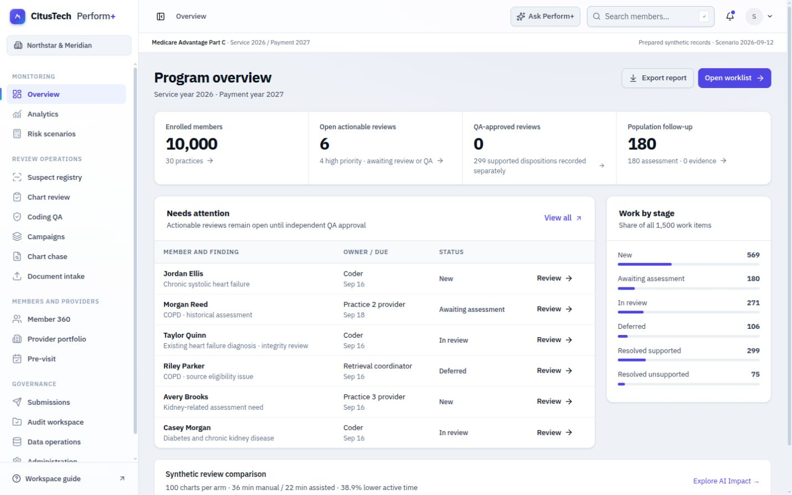
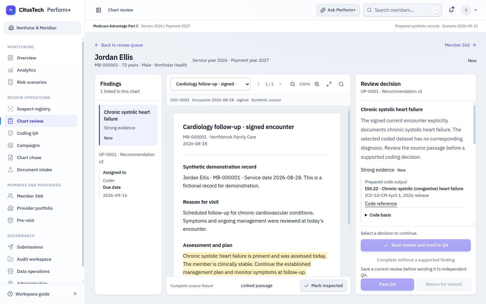
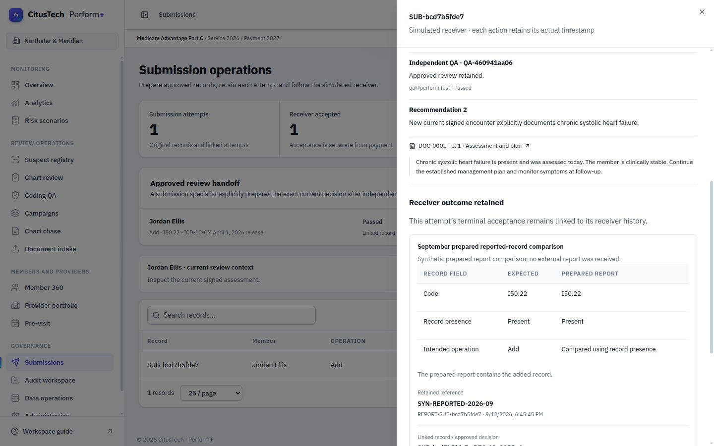

# Assessment screenshots

62 inspected desktop captures for the implementation of [the capability assessment](../../Perform_Plus_Demo_Assessment.md). [Verification report](../../docs/ASSESSMENT_VERIFICATION.md) · [capture manifest](manifest.json).

| Folder | Contents |
| --- | --- |
| [before](before/) | 20 earlier-implementation views. Four original preview captures; sixteen explicitly reconstructed from preserved original UI/API images and fresh synthetic data. |
| [after](after/) | 20 matching views of the updated `:3002` preview, preserving its existing records and accounts. |
| [journeys](journeys/) | Local role handoffs, rework, source validation/publication, linked submissions and prepared reports in the isolated `:3003` rehearsal. |
| [desktop](desktop/) | Dense review and intake layouts at 1366×768 and a wider review at 1920×1080. |
| [analytics](analytics/) | The nine supporting analytics views, in addition to AI Impact in the matching screen set. |

All matching pairs use a 1440×900 CSS viewport. The manifest records actual native image dimensions, route, role, case state, capture time and runtime basis. Native screenshots can have slightly different pixel dimensions from the CSS viewport; the images were not resized or edited.

The valid original baseline captures are login, overview, suspects and Jordan review. Other initial captures showed loading frames; replacements use the preserved earlier application in a dedicated baseline environment. [Reconstruction metadata](baseline-reconstruction.json) identifies those original image versions. Reconstructed images demonstrate the previous implementation, with fresh synthetic state rather than an assertion that every mutable record matches the original preview.

The operational preview remains at [localhost:3002](http://localhost:3002). The workflow captures show prepared synthetic outcomes, not real delivery, official numeric scoring or payment reconciliation.

After these captures, the user approved a protected backup and two reset cycles of the isolated `:3003` rehearsal. It is now at the starting baseline; these workflow images continue to document the completed earlier walkthrough. The `:3002` preview was unchanged. See [reset verification metadata](reset-verification.json).

